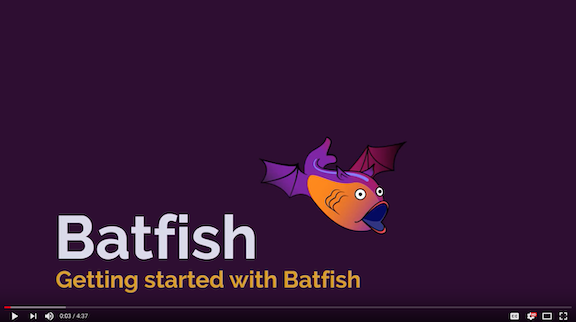

**Got questions, feedback, or feature requests? Join our community on [Slack!](https://join.slack.com/t/batfish-org/shared_invite/enQtMzA0Nzg2OTAzNzQ1LTUxOTJlY2YyNTVlNGQ3MTJkOTIwZTU2YjY3YzRjZWFiYzE4ODE5ODZiNjA4NGI5NTJhZmU2ZTllOTMwZDhjMzA)**

## What is Batfish?

Batfish is a network validation tool that provides correctness guarantees for security, reliability, and compliance by analyzing the configuration of network devices. It builds complete models of network behavior from device configurations and finds violations of network policies (built-in, user-defined, and best-practices).

A primary use case for Batfish is to validate configuration changes *before* deployment (though it can be used to validate deployed configurations as well). Pre-deployment validation is a critical gap in existing network automation workflows. By  Batfish in automation workflows, network engineers can close this gap and ensure that only correct changes are deployed.

**Batfish does NOT require direct access to network devices.** The core analysis requires only the configuration of network devices. This analysis may be enhanced using additional information from the network such as:
* BGP routes received from external peers
* Topology information represented by LLDP/CDP

See [www.batfish.org](http://www.batfish.org) for technical information on how it works. 

## What kinds of correctness checks does Batfish support?

The [Batfish YouTube channel](https://www.youtube.com/channel/UCA-OUW_3IOt9U_s60KvmJYA/videos) (which you can subscribe to for new content) illustrates many types of checks. These checks span a range of network behaviors and device configuration attributes.
#### Configuration Compliance
* Flag undefined-but-referenced or defined-but-unreferenced structures (e.g., ACLs, route maps)
* Configuration settings for MTUs, AAA, NTP, logging, etc. match templates
* Devices can only be accessed using SSHv2 and password is not null
#### Reliability
* End-to-end reachability is not impacted for any flow after any single-link or single-device failure
* Certain services (e.g., DNS) are globally reachable
#### Security
* Sensitive services can be reached only from specific subnets or devices
* Paths between endpoints are as expected (e.g., traverse a firewall, have at least 2 way ECMP, etc...)
#### Change Analysis
* End-to-end reachability is identical across the current and a planned configuration
* Planned ACL or firewall changes are provably correct and causes no collateral damage for other traffic
* Two configurations, potentially from different vendors, are functionally equivalent

  
## How do I get started?

Getting started with Batfish is easy, just grab the latest `allinone` Batfish Docker container:

  `docker pull batfish/allinone`

The container has:
* Batfish server
* Jupyter notebook [server](http://jupyter.org/)
* Example [Jupyter notebooks](https://github.com/batfish/pybatfish/tree/master/jupyter_notebooks)

Once you have installed the container, the first thing we recommend is walking through the Jupyter notebooks. Each notebook highlights different capabilities of Batfish and shows you how to exercise it. Check-out this [README](https://github.com/batfish/pybatfish/tree/master/jupyter_notebooks) for the detailed list of notebooks.

### Running the example notebooks

To run through the example Jupyter notebooks, start the docker container:

  `docker run -p 8888:8888 batfish/allinone`

When this container starts, Jupyter will show a token required for access (e.g. **token=abcdef123456...**). Make note of this, as you will need it to access the Jupyter server.

Now just open your web-browser and navigate to [http://localhost:8888](http://localhost:8888) enter the token in the Password or token: prompt to access the notebooks.
  
  
## Evaluate your own network configurations

Now that you are familiar with the capabilities of Batfish, you are ready to analyze your network configurations. The first thing to do is create a local data directory. This is a folder on the host machine running the docker container, where Batfish will persist data across container reboots. 

  `mkdir -p data`

Stop and restart the container. 

  `docker stop $(docker ps -f "ancestor=batfish/allinone" -q)`
  
  `docker run -v $(pwd)/data:/data -p 9997:9997 -p 9996:9996 batfish/allinone`

This starts the service after mapping the local data folder to the data folder within the container and exposing the TCP ports required by the Batfish service. 

Next, you need to install [Pybatfish](https://www.github.com/batfish/pybatfish) (the Python SDK) in order to interact with the service.

## Download and install Pybatfish
First, clone the Github repository. Change to the directory where you would like to clone the repository and issue the git command below.

  `cd /path/to/directory/where/you/want/to/clone/repo`
  
  `git clone git@github.com:batfish/pybatfish.git`

Then, install Pybatfish. We highly recommend that you install Pybatfish in a Python 3 virtual environment. Details on how to set one up can be found [here](https://docs.python.org/3/library/venv.html). 

Once your virtual environment is setup and activated, issue the following commands

  `cd /path/to/directory/where/you/want/to/clone/repo/pybatfish`
  
  `pip install -e .`

Now, you are ready to evaluate your own network with Batfish.We encourage you to use Jupyter notebooks as your starting point, but you can use other methods that you are a comfortable with, e.g., an IDE like PyCharm or an interactive Python shell.
If you choose to use Jupyter notebooks as your starting point, you need to install Jupyter in your virtual environment. Jupyter documentation can be found [here](http://jupyter.org/install) - but the commands below will get you going.

   `pip install --upgrade pip`
   
   `pip install jupyter`
   
   `jupyter notebook`

Our notebooks provide a quick start guide for different use cases. Beyond that, the complete documentation is available on [readthedocs](https://pybatfish.readthedocs.io/en/latest/quickstart.html). 

## System Requirements for running Batfish

Batfish can be run on any operating system that supports Docker. The containers are actively tested on Mac OS X and Ubuntu 16.04 LTS.

To get started with the example Jupyter notebooks, all you need is a reasonably capable laptop:

* Dual core CPU
* 8 GB RAM
* 256 GB hard-drive

When you transition to running Batfish on your own network, we recommend a server that at least has:

* Quad-core CPU with 2 threads per CPU
* 32 GB RAM
* 256 GB hard-drive

 
## Supported Network Device and Operating System List

Batfish supports configurations for a large and growing set of (physical and virtual) devices, including:

* Arista
* Aruba
* AWS (VPCs, Network ACLs, VPN GW, NAT GW, Internet GW, Security Groups, etc…)
* Cisco (All Cisco NX-OS, IOS, IOS-XE, IOS-XR and ASA devices)
* Dell Force10
* Foundry
* iptables (on hosts)
* Juniper (All JunOS platforms: MX, EX, QFX, SRX, T-series, PTX)
* MRV
* Palo Alto Networks
* Quagga / FRR
* Quanta
* VyOS

If you'd like support for additional vendors or currently-unsupported configuration features, let us know via [Slack](https://join.slack.com/t/batfish-org/shared_invite/enQtMzA0Nzg2OTAzNzQ1LTUxOTJlY2YyNTVlNGQ3MTJkOTIwZTU2YjY3YzRjZWFiYzE4ODE5ODZiNjA4NGI5NTJhZmU2ZTllOTMwZDhjMzA)or [GitHub](https://github.com/batfish/batfish/issues/new). We'll try to add support. Or, you can -- we welcome pull requests! :)
