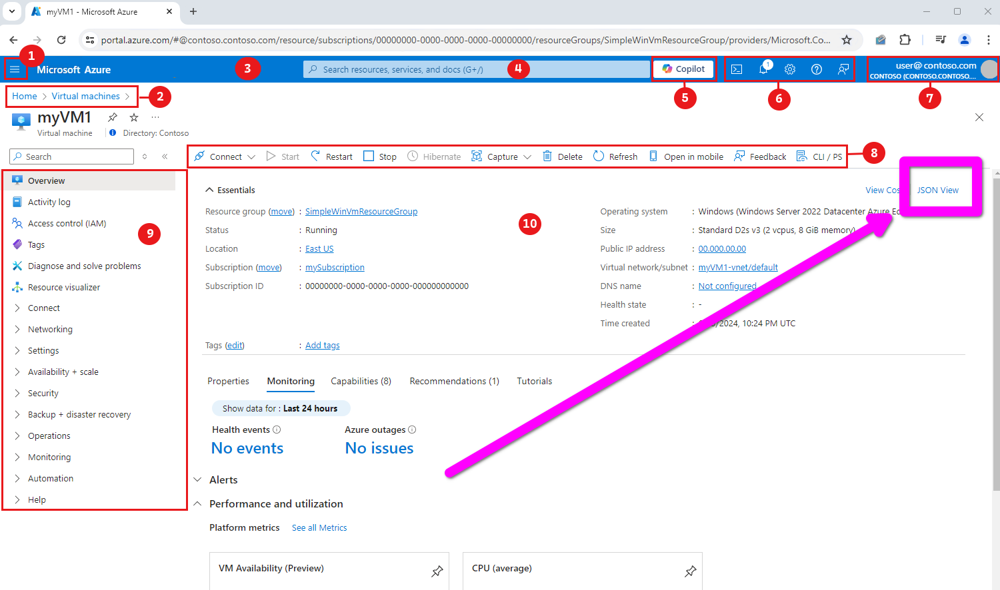
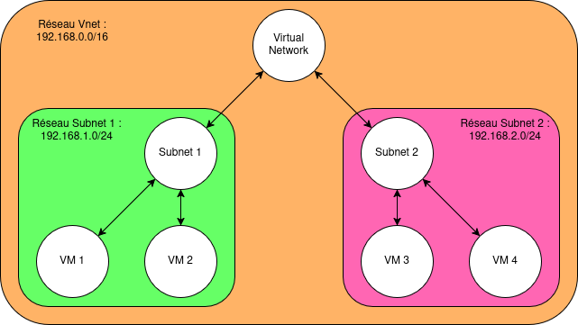

# Azure Resource Modeling
**Author:** @RP38  
**Date:** April 2025

This document outlines Batfish’s comprehensive approach to modeling Azure resources. For detailed guidance on specific modeling aspects, please refer to the following resources:

- [Integrating Internet with Azure](nat-gateway.md)
- [Azure Network Security Groups Overview](network-security-groups.md)

## Input Requirements

To effectively utilize Batfish, you must provide all relevant Azure resources you wish to include in your model. **Important:** When including a resource, ensure that all its dependencies are also included. For instance, if you are incorporating a virtual machine (VM), you must also include its associated network interface.

To export these resources in JSON format, simply click the **pink button**.




# Batfish Azure Resource Packaging and Processing

## Packaging Structure

Batfish expects Azure resources to be organized in the following directory structure:

```
<snapshot>
    └── azure_configs
        └── Vpcs.json
        └── ...
```

## Parsing Process

Batfish parses these JSON files into the `AzureConfiguration.java` class, which contains a list of regions. 
Within each region, there are maps for various concepts, such as Virtual Machines, Network Interfaces, and more. 
Each map associates an ID (that every azure resource have) with a corresponding Java object that represents it.

## Conversion to VI Model

The conversion to the VI model begins with `AzureConfiguration.java`. The overall process involves:

1. **Node Creation**: Nodes are created for most concepts, including Virtual Machines (VMs), subnets, virtual networks, and gateways etc.
2. **Interface Connections**: Interfaces are established on these nodes and assigned IP addresses to ensure that Batfish’s Layer 3 (L3) inference connects them appropriately.

Most IP addresses are parsed from their respective JSON file ranges, with the exception of certain pure network resources, such as PostgreSQL databases.

### Intended Topology

- **Network Security Groups**: These are processed to control traffic entering and exiting host and subnet nodes.
- **Route Tables**: Processed at the subnet level, static routes are installed on virtual networks, subnets, and gateway nodes to facilitate routing.

### Traffic Patterns

#### Within the Same Subnet

- **Private IP Communication**: When the destination IP is within the private IP space, a shared LAN is created between instances and the subnet, allowing direct communication between instances.
- **Public IP Communication**: When the destination IP is a public IP assigned to a host within the subnet, traffic is routed to the Internet as usual (see “From Host to Internet” below) and returns to the intended host.

#### Across Different Subnets

The traffic flow between two hosts across different subnets follows this path:

```
[Src-host] -> src-subnet-router -> vnet-router -> dst-subnet-router -> dst-host
```

- The second hop to the `vnet-router` occurs if the source subnet’s route table points to the `vnet-router` for the private address space (which is typically the case). If not, the traffic is routed to the Internet (see “From Host to Internet” below).
- The third hop to the destination subnet router is facilitated by explicitly installing static routes for individual subnets on the `vnet-router`, pointing to the respective subnet routers. This explanation also applies in cases of virtual network peering.



### From Host to Internet

The traffic flow from a host to the Internet is as follows:
```
[src-instance] -> src-subnet -> internet-gateway -> azure-bb -> internet
```


- The second hop to the `internet-gateway` occurs only if the source subnet has a proper entry (e.g., default) to the internet gateway.
- According to internet modeling, the internet gateway receives the default route from the Internet via `aws-bb`.


### From Internet to Public IP (to Host)

The traffic flow from the Internet to a public IP assigned to a host is as follows:
```
[internet] -> ISP -> internet-gateway -> subnet-router -> host
```

- The second hop to the `internet-gateway` occurs because the gateway announces all of its public IPs to the ISP.
- The third hop occurs because we install static routes on the gateway that point to the subnet router (for the subnet's private IP space).


## Limitations

- **User Defined Routes (UDR)**: Currently, UDRs are not supported in this model.