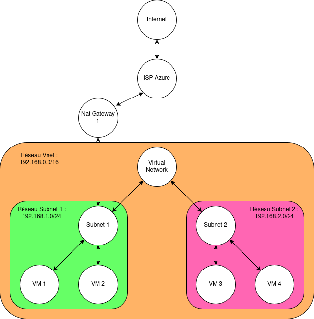

# Internet Access in Azure

Azure provides several methods for granting Internet access to Azure resources. Currently, the following methods are implemented:

- **NAT Gateway** (recommended by Azure)
- **Public IP**

## NAT Gateway

### How It Works

NAT Gateways are deployed in public subnets and can be associated with one or more public IP addresses. Key details include:

- **Multiple Public IPs**: NAT Gateways can utilize multiple public IPs, either individually or as a range.
- **Routing**: Hosts access the NAT Gateway through their subnet routing table, which points to the NAT Gateway. Traffic leaving the NAT Gateway is directed to the Internet.
- **Port Usage**: NAT Gateways use ports in the range of 1024–65535.
- **Supported Protocols**: The NAT Gateway supports TCP, UDP, and ICMP protocols.

### Packet Flow

To illustrate how packet flows traverse through a NAT Gateway, consider the following example of an instance sending a packet to Google:

1. **Packet Initiation**: The host sends a packet from `[host-private-ip]` to `[google-ip]`.
2. **Subnet Router**: The packet reaches the subnet router (no transformation occurs at this stage).
3. **NAT Gateway**: The packet then arrives at the NAT Gateway (still no transformation).
4. **NAT Transformation**: The NAT Gateway transforms the packet to `[nat-public-ip]` to `[google-ip]`, using a specific port (either random or the same if available), and sends it to the Internet.
5. **Response Reception**: The response from Google reaches the NAT Gateway as `[google-ip]` to `[nat-public-ip]`.
6. **Reverse Transformation**: The NAT Gateway transforms the packet back to `[google-ip]` to `[host-private-ip]` and forwards it to the subnet router.
7. **Final Delivery**: From the subnet router, the packet reaches the host.

### Batfish Modeling

In Batfish, since a NAT Gateway can be utilized by multiple subnets, it is integrated as a standalone node for easy reuse. Most operations on this node are standard according to Batfish utilities and do not require further description.

## Public IP

### How It Works

In Azure, hosts communicate with each other using network interfaces. A public IP can be directly assigned to a host's interface, allowing it to communicate with the Internet without the need for additional configurations. This direct assignment simplifies the communication process, as the host can send and receive traffic using its public IP.

Public IPs function similarly to NAT Gateways, but with the following distinctions:

- **Static Assignment**: The assigned public IP is guaranteed to remain constant, eliminating concerns about source port changes.

### Batfish Modeling

Since packet flow is tied to Batfish modeling, we will explain the modeling approach first. In the current implementation, public IPs are also managed by the NAT Gateway. The NAT Gateway is responsible for advertising the public IP of the interface within the subnet it is linked to, applying Source Network Address Translation (SNAT) and Destination Network Address Translation (DNAT).

In cases where a subnet does not use a NAT Gateway but has hosts with interfaces assigned public IPs, a “ghost” NAT Gateway is created to perform these tasks.

#### Why Use a Ghost NAT Gateway?

Using a ghost NAT Gateway simplifies the modeling process, reduces complexity, and centralizes management. This approach ensures compatibility with network security groups and other configurations.

### Packet Flow

The journey of a packet when using a public IP is as follows:

1. **Packet Initiation**: The host sends a packet from `[host-private-ip]` to `[google-ip]`.
2. **Subnet Router**: The packet reaches the subnet router (no transformation occurs at this stage).
3. **NAT Gateway**: The packet then arrives at the NAT Gateway (still no transformation).
4. **NAT Transformation**: The NAT Gateway transforms the packet to `[host-public-ip]` to `[google-ip]` and sends it to the Internet (SNAT).
5. **Response Reception**: The response from Google reaches the NAT Gateway as `[google-ip]` to `[host-public-ip]`.
6. **Reverse Transformation**: The NAT Gateway transforms the packet back to `[google-ip]` to `[host-private-ip]` and forwards it to the subnet router.
7. **Final Delivery**: From the subnet router, the packet reaches the host.

