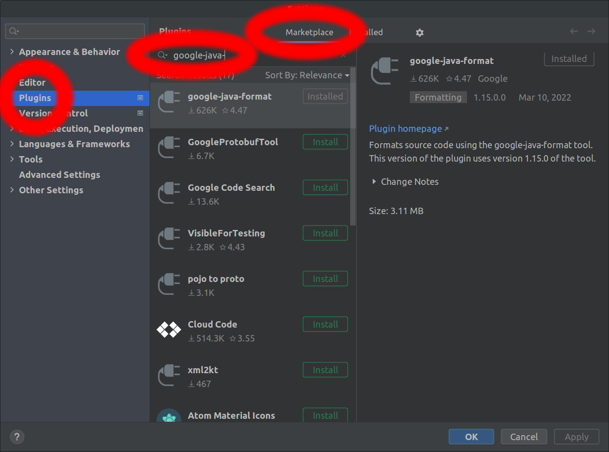

# Setup the IntelliJ IDE

There are a few steps to make sure that IntelliJ can build Batfish correctly.

## Pre-requisites

* Cloned and compiled Batfish per [these instructions](Building-and-running-Batfish-service)

## 1. Install IntelliJ plugins

Install the following plugins by opening `Preferences` > `Plugins` > `Browse Repositories` and then searching for the relevant plugin:



### google-java-format
Batfish uses the `google-java-format` plugin to format the code, so that all users end up with code the same style (in IntelliJ as well as in any other editors).

### Bazel
You'll need the [`bazel`](https://plugins.jetbrains.com/plugin/8609-bazel) plugin in order to build.

## 2. Raise the default IDE file size limits

The ANTLR4-generated Java files that contain configuration parsers are very large. To enable IntelliJ to index them, we need to raise IntelliJ's default file size limits.

From the menu bar, choose `Help` > `Edit Custom Properties` and then enter the following in the `idea.properties` file that is opened.

```
# custom IntelliJ IDEA properties

idea.max.intellisense.file.length=500000

#---------------------------------------------------------------------
# Maximum file size (kilobytes) IDE should provide code assistance for.
# The larger file is the slower its editor works and higher overall system memory requirements are
# if code assistance is enabled. Remove this property or set to very large number if you need
# code assistance for any files available regardless their size.
#---------------------------------------------------------------------
idea.max.intellisense.filesize=50000
```

## 3. Import the Batfish Bazel project

1. Open IntelliJ and choose `Import Bazel Project` (under `File`, or from the main splash screen).
1. In the file dialog that results, choose the `batfish` directory that is the root of the cloned git repository.
1. Just hit `Next` until you get to the main window; the default settings work fine.

## 4. Go

On opening, IntelliJ will run a `bazel sync` to learn the project structure and targets.

For synced files, IntelliJ's bazel plugin run unit tests, debug, add new Run Configurations, etc. in the usual way.

For more information or advanced use cases, see the Bazel IntelliJ [documentation](https://ij.bazel.build/docs/bazel-plugin.html).


