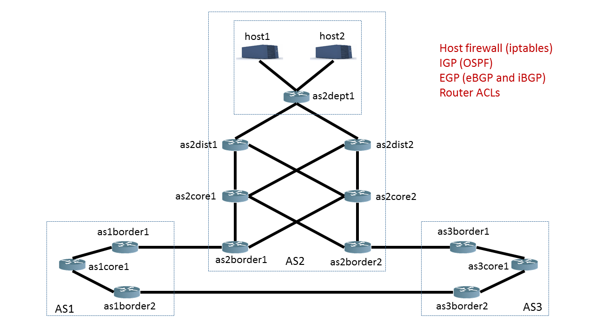

## Example network

This directory contains an example network for a school campus.

The topology of the network is show below: 

The example contains three different subnetworks corresponding to the campus (AS2) and a simplified view of two upstream providers (AS1 and AS3) and the connectivity between them.

There are several snapshots for this network which can be used to exercise and understand various analysis capabilities in Batfish.

1. `live`: The snapshot of the device configurations currently deployed in this network.

1. `candidate`: A pre-flight version of a candidate change that the network operator wants to deploy. The goal of this change is to add some ACLs to the network safely, without disrupting connectivity of supported services. However, there is an error in the change: an access-group is applied in the wrong direction.

1. `live-with-bgp-announcements`: This version has the same configuration as `live` and adds a snapshot of BGP announcements received from external networks. Batfish incorporates these routing announcements when computing the data plane of the network.

1. `live-with-interface-outage`: The `live` snapshot, but with `as2border2` interface `GigabitEthernet0/0` down (connecting AS2 and AS3), specified in the `interface_blacklist` file.

1. `live-with-isp`: AS1 and AS3 in `live` snapshot replaced with abstract configurations of ISPs. The ISPs are formed based on the configuration in `batfish/isp_config.json`.